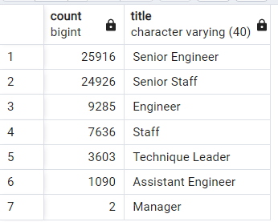
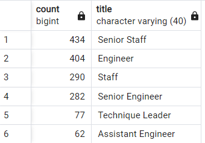

# Pewlett-Hackard-Analysis
## Overview of the analysis

Pewlett Hackard is a large employee based firm with large number of senior employees who will be retiring soon and that will result in a significant number of job openings in the organization. The purpose of the analysis was to determine how many employees will be retiring and those who qualify to participate in a mentorship program to train the future generation of workers who would run Pewlett Hackard's operations and day-to-day activities. 

A complete entity relationship diagram to reference for the analysis is as below,

## Results
## The Number of Retiring Employees by Title
### * Retirement Titles

Below pic shows the data from retirement_titles table that holds all the titles of employees who were born between January 1, 1952 and December 31, 1955.

### * Unique Titles

There are duplicate entries for some employees because they have switched titles over the years. Following table shows how the data looks like after removing those duplicates and keeping only the most recent title of each employee.

### * Retiring Titles

The number of employees by their most recent job title who are about to retire looks like this,

### * Mentorship Elegibility

The Employees Eligible for the Mentorship Programs

## Summary

* How many roles will need to be filled as the "silver tsunami" begins to make an impact?

There are 90,398 roles that need to be filled as the "silver tsunami" begins to make an impact. 

* Are there enough qualified, retirement-ready employees in the departments to mentor the next generation of Pewlett Hackard employees?

There are 90398 people who are retiring and the total number of 1549 employees have been chosen for the mentorship. The numbers are very less when only a single year is considered (birth dates are between January 1, 1965 and December 31, 1965). Considering Manager title, two of them who are going to retire, are not eligible for the mentorship. In that case we could increase the mentorship eleigibility criteria.

   Retiring Employees                   |  Mentorship Eligible Employees
:--------------------------------------:|:-------------------------:
  |  